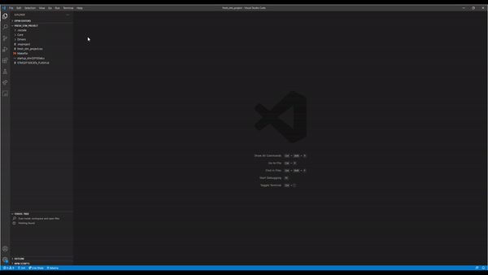

# STM32 for VSCode

An extension to compile, debug, and flash STM32 projects. This extension is built to work in conjunction with STM32CubeMX, and will install the required toolchain when desired. It will automatically startup when it finds a CubeMX file or an STM32 for VSCode configuration file.

This extension also supports using cpp files; however, `main.c` has to be manually renamed to `main.cpp` for it to work.

NOTE: Your CubeMX project needs to be generated as a makefile project under "Project Manager -> Project -> Toolchain/IDE".

## Prerequisites
There are a few command line tools that need to be installed for this extension to work. You can either add them manually or let the extension automatically install them for you. This option will be shown on start-up.

### Automatic installation

- [STM32 CubeMX](https://www.st.com/en/development-tools/stm32cubemx.html)
- [Cortex-Debug extension](https://github.com/Marus/cortex-debug)
- [GNU Arm Embedded Toolchain](https://developer.arm.com/open-source/gnu-toolchain/gnu-rm/downloads)
- Make (platform dependent, [Windows](http://gnuwin32.sourceforge.net/packages/make.htm), OSX: install command line developer tools)
- OpenOCD: [Windows](https://gnutoolchains.com/arm-eabi/openocd/), [all platforms](https://xpack.github.io/openocd/install/)

## Configuring CubeMX
This extension assumes the project is initialized with CubeMX and the option to create a Makefile project under "Project Manager -> Project -> Toolchain/IDE".

Also, please leave the default on Copy all used libraries into the project folder.

## How to Use
Click on the ST icon and select the command you want to run. Once this is done for the first time you can also use the shortcut cmd/ctrl+shift+b to start building.

## Features
- Creating a makefile and building and STM32 project.
- Adding configurations for debugging, flashing and building in the workspace.
- Ability to compile as a C++ project by adding a main.cpp file.
- Automatic configuration of IntelliSense.
- Detection and installation of an embedded toolchain
- Configuration file per project.
- Searches for .c/.cpp and .h/.hpp files in your project.
- Add static libraries for compilation.
- Import existing CubeIDE projects or STM32CubeMX examples.

### Build Process
The build process uses the information of the CubeMX makefile and the STM32-for-VSCode.config.yaml file to search for dependencies and set flags. The makefile is optional, however the STM32-for-VSCode.config.yaml will always be present when building. After it has gathered all the files and information it will check if the STM32 for VSCode specific makefile needs to be updated, if so it will update the makefile and run the make/build process.

### Configuration
The recommended way of configuring the build (i.e., adding flags, adding files/directories) is by means of the `STM32-for-VSCode.config.yaml` file. The yaml file contains comments and explanations of each part of the file and should be self explanatory. If its use is non-obvious, or if you require additional parameters, feel free to open an issue at: https://github.com/bmd-studio/stm32-for-vscode/issues.

### Importing
STM32CubeIDE and ST provided example projects can now be imported by using the: "import CubeIDEProject" command. Do note that the project folder should be open in the workspace.

## Disclaimer
This an extension created because I wanted a fast way to build, flash and debug STM32 on OSX in VSCode. This extension is used internally at Bureau Moeilijke Dingen for development. As this might be helpful to others, I have allocated time to publish this extension. Should you find any bugs or have feature requests, please open an issue in the [GitHub repository](https://github.com/bmd-studio/stm32-for-vscode/issues).
